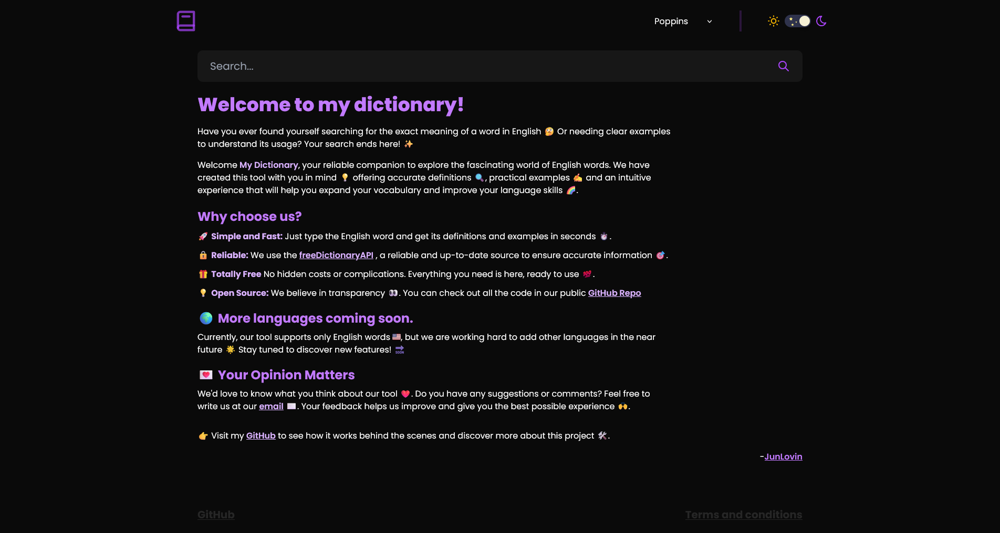
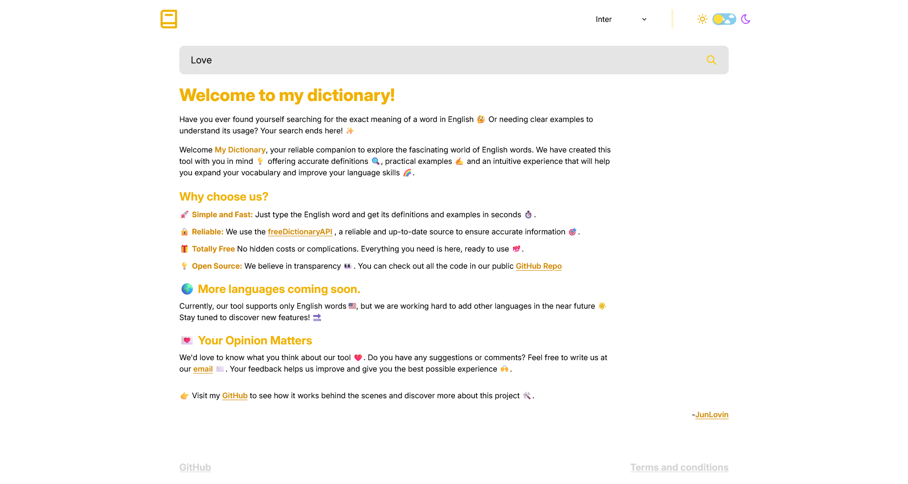
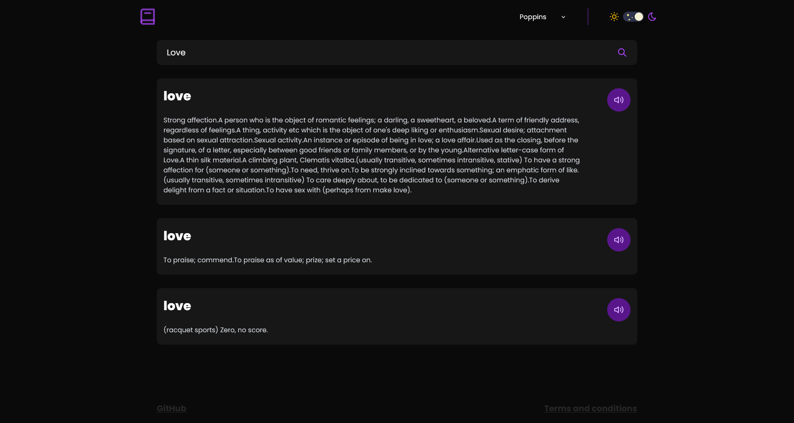
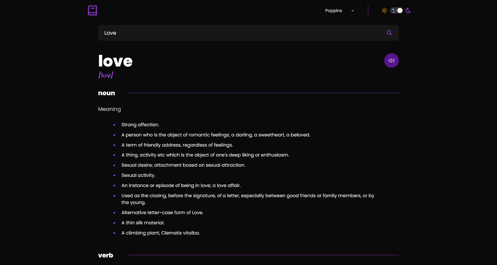
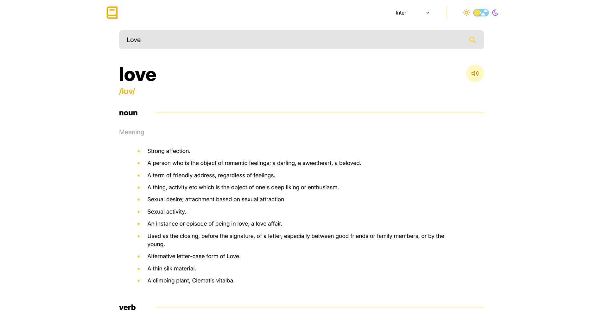

# 📚 Dictionary App








## 🌟 Descripción

**Dictionary App** es una aplicación web moderna que te permite buscar definiciones de palabras en inglés de manera rápida y sencilla. Con una interfaz elegante y minimalista, esta aplicación te ofrece:

- 🔍 Búsqueda instantánea de palabras
- 🔊 Pronunciación de audio (cuando está disponible)
- 📝 Definiciones detalladas y ejemplos de uso
- 🌙 Modo oscuro/claro para una experiencia visual personalizada
- 📱 Diseño responsive para todos los dispositivos

## ✨ Características principales

- **Búsqueda rápida**: Simplemente escribe una palabra y presiona Enter
- **Tarjetas de definición**: Visualiza las definiciones en un formato claro y organizado
- **Detalles completos**: Accede a información detallada sobre cada palabra, incluyendo:
  - Pronunciación fonética
  - Definiciones como sustantivo y verbo
  - Ejemplos de uso
  - Enlaces a fuentes
- **Experiencia personalizada**: Cambia entre modo claro y oscuro según tus preferencias

## 🚀 Demo

[Ver Demo en vivo](https://dictionary-eosin-theta.vercel.app/)

## 🛠️ Tecnologías utilizadas

- **React** - Framework de JavaScript para la interfaz de usuario
- **React Router** - Navegación entre páginas
- **Tailwind CSS** - Framework de CSS para el diseño
- **Vite** - Herramienta de construcción y desarrollo
- **Free Dictionary API** - API para obtener definiciones de palabras

## 📋 Requisitos previos

- Node.js (versión 18 o superior)
- npm o yarn

## ⚙️ Instalación

Sigue estos pasos para instalar y ejecutar el proyecto en tu máquina local:

1. **Clona el repositorio**

```bash
git clone https://github.com/JunLovin/dictionary.git
cd dictionary
```

2. **Instala las dependencias**

```bash
npm install
```

3. **Ejecuta el proyecto**

```bash
npm run dev
```

4. **Abre tu navegador**

La aplicación estará disponible en `https://localhost:5173`

## 🎮 Cómo usar

1. Buscar una palabra :
   
   - Escribe la palabra que deseas buscar en el campo de búsqueda
   - Presiona Enter para ver los resultados
2. Explorar definiciones :
   
   - Navega por las tarjetas de definición que aparecen
   - Haz clic en el botón de audio para escuchar la pronunciación (si está disponible)
3. Ver detalles completos :
   
   - Haz clic en cualquier tarjeta para ver información más detallada sobre la palabra
   - Explora las diferentes definiciones, ejemplos y fuentes
4. Cambiar el tema :
   
   - Utiliza el interruptor en la parte superior para cambiar entre modo claro y oscuro

## 🤝 Contribuir

¡Las contribuciones son bienvenidas! Si deseas contribuir a este proyecto:

1. Haz un fork del repositorio
2. Crea una rama para tu característica ( git checkout -b feature/amazing-feature )
3. Haz commit de tus cambios ( git commit -m 'Add some amazing feature' )
4. Haz push a la rama ( git push origin feature/amazing-feature )
5. Abre un Pull Request

## 📞 Contacto\

Mathias Said - @JunLovin - mathiassaid7@gmail.com

Enlace del proyecto: https://github.com/JunLovin/dictionary

## 🙏 Agradecimientos

- Free Dictionary API por proporcionar los datos de las definiciones
- Tailwind CSS por el framework de diseño
- React por el framework de JavaScript
- A todos los que han contribuido y apoyado este proyecto